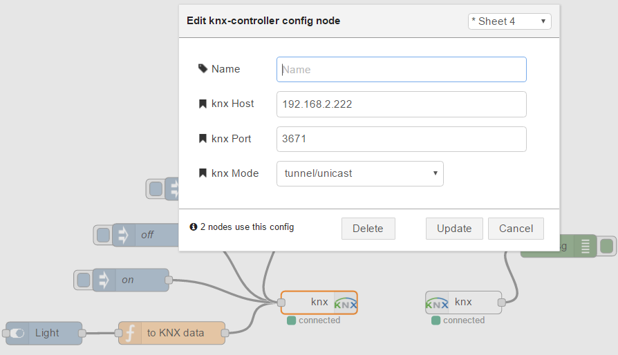
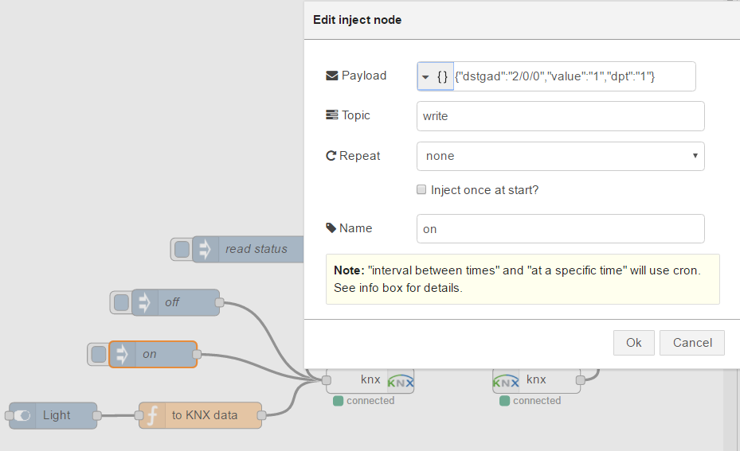
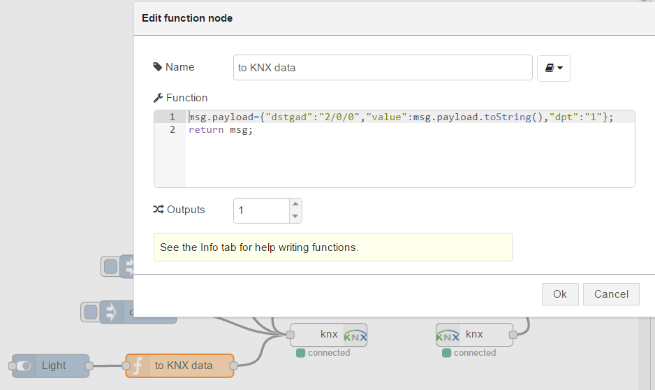
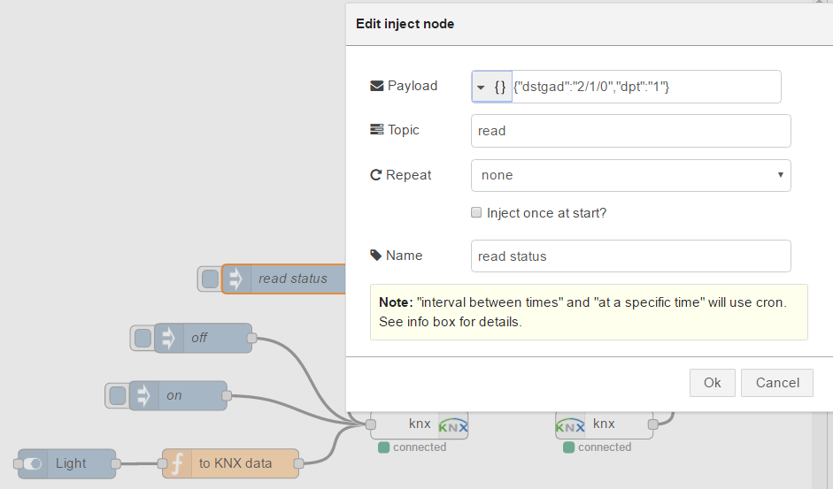

node-red-contrib-knx
==========================
## Description
KNX/eib nodes for node-red.

Inspired by https://github.com/ekarak/node-red-contrib-eibd.

KNX for node-red, utilizing pure JavaScript KNXnet/IP driver (both works: tunelling & routing).
Uses the pure JavaScript implementation of eib/knx driver for Node.JS (https://github.com/estbeetoo/knx.js). 

## Install via NPM

From inside your node-red directory:
```
npm install node-red-contrib-knx
```

## What's inside?
It will include three nodes:

-- 'knx-controller' : a unique CONFIG node that holds connection configuration for knx and will acts as the encapsulator for KNX access. As a node-red 'config' node, it cannot be added to a graph, but it acts as a singleton object that gets created in the the background when you add an 'knx' or 'knx-device' node and configure it accordingly.

-- 'knx-out' : KNX/EIB output node that can send KNX to arbitrary GA's and datatypes, so it can be used with function blocks.

-- 'knx-in': KNX/EIB listener node, who emits flow messages based on activity on the KNX bus:

Both use the same message format, an example message follows:

{ "topic": "knx: write", "payload": { "srcphy": "1.1.100", "dstgad": "5/0/2", "dpt": "DPT1", "value": 0 } }

-- topic is: *"knx: (telegram type)" where (telegram type) is 'read' (read requests), 'response' (to read requests) and 'write' (to update GA's)

-- payload contains:

--- srcphy: source physical address (the device that sent the KNX/EIB telegram) - this information is only emitted by knx-in, and will be ignored by knx-out (no address spoofing, you naughty haxx0r!)

--- dstgad: destination group address (the function that this telegram refers to eg. front porch lights) - REQUIRED

--- dpt: datapoint type (1 for booleans, 5 for 4-bit dimming setpoints etc) - defaults to 1 for boolean on/off GA's

--- value: the destination group address's value conveyed in the telegram - REQUIRED

**Right now it not tested in all directions, but tunnelling mode (only write commands) are working.**
**It tested with KNXnet/IP routers: ABB IPR/S 2.1, Weinzierl BAOS 771**
 
## Usage


###'knx-in' and 'knx-out' node configuration:


###'knx-controller' CONFIG node configuration:



### How send value to KNX by Inject-node:



### How send value to KNX by Function-node:



### How make read-request to KNX by Inject-node:




According to official documentation: http://nodered.org/docs/getting-started/adding-nodes.html
 
## License

